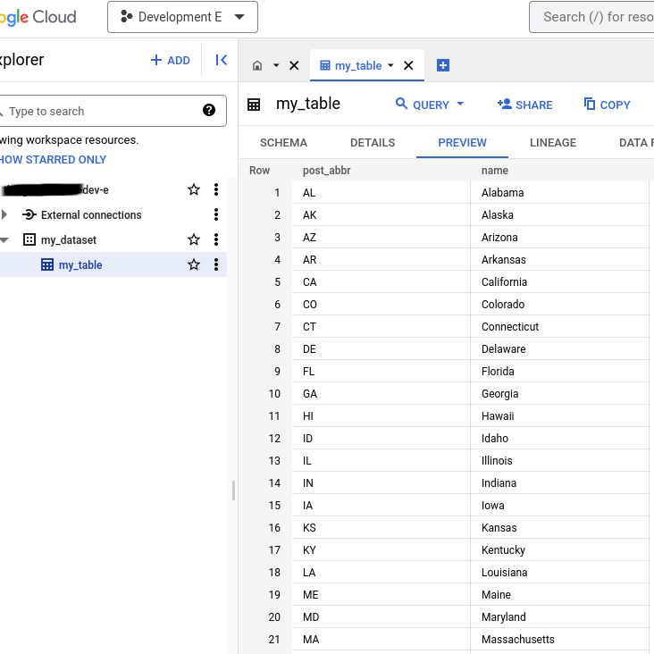
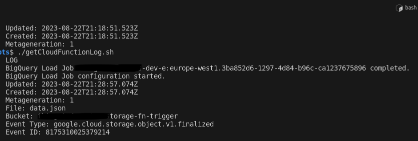

# reference-challenge-solution
Reference Challenge Solution

## Solution
With a Cloud Function receiving a trigger for each 'google.cloud.storage.object.v1.finalized' event fired by a given Storage bucket, the Cloud Function's code then instantiate's a BigQuery Load Job and awaits the Job's completion. Having the lifting of the Load Job completed by BigQuery rather than the Cloud Function keeps the code extremely light and the instance requirements to a minimum.


## Resources
- BigQuery
    - table: my_table
    - dataset: my_dataset
- Cloud Storage 
    - Private Bucket
- Cloud Function
    - Read from Storage
    - Write to bq


## Requirements
Explicitly defined requirements include:
- Function service account should have the following service account role permissions:
    - read from a specific storage bucket only
    - write to a specific bq table only
- Function entry point must be 'loadFile'
- BigQuery:
    - created dataset must have name 'my_dataset'
    - created table must have name 'my_table'
    - dataset table my_dataset.my_table schema will be inferred from Cloud Function data
- Best practices are to be adopted
Implicitly defined requirements include:
- All resources will be defined in the 'EU' region 'europe-west1'


## Best Practices
- Cloud Function:
    - use Node.js 18 LTS Runtime 'nodejs18'
    - minimize role permissions to only those required to execute the task eg. 'roles/storage.objectViewer'
- Cloud Storage:
    - Uniform permissions are in use


## Build Cloud Function
- Select the correct runtime from nvm
- Use the correct EventArc Cloud Event ID
- Build and zip for deployment into source storage bucket


## Build Infrastructure
- [Optional] Create Project and associate Billing Account
- Define the Application Default Credentials for the build tools:
```
gcloud auth application-default login
```
- Enable APIs:
    - Cloud Functions API
    - BiqQuery API
    - Cloud Storage API
    - EventArc API
    - Cloud Build API
    - Pub/Sub API
    - Cloud Run API
```
gcloud services enable \
    cloudbuild.googleapis.com \
    eventarc.googleapis.com \
    pubsub.googleapis.com \
    run.googleapis.com \
    storage.googleapis.com
```
- Create service account for Cloud Function with script:
```
./scripts/createServiceAccount.sh
```
- Create the infrastructure:
```
terrafom -chdir=infrastructure init
terrafom -chdir=infrastructure fmt
terrafom -chdir=infrastructure validate
terrafom -chdir=infrastructure plan -out=terraform.plan
terrafom -chdir=infrastructure apply terraform.plan
```
- Test the infrastructure:
    - Make sure storage is not public:
    ```
    ./scripts/chekBucketsForPublicAccess.sh
    ```
    - Make sure BigQuery dataset is not public:
    ```
    ./scripts/checkBigQueryForPublicAccess.sh
    ```
- Test pipeline triggers with data:
```
./scripts/checkDataIngressPipeline.sh ./path/to/data.json
```


## Validation
Check the data is imported into the BigQuery dataset:


Check the Cloud Function logs for successful completion of the BigQuery Load Job:



## Refactoring
To further improve the security posture of the project, some refactoring might involve:
- Move function deployment to Terraform with the source distributed via Google Cloud Storage
- Grant the service account a Custom Role that contains more finely grained permissions
- IAM Condition to restrict the Cloud Function service account access to the named buckets only
    eg. in CEL for IAM Conditions, only allow the service account to read from the bucket 'private-restricted-assets' 
        resource.type == "storage.googleapis.com/Object" &&
            resource.name.startsWith("projects/_/buckets/private-restricted-assets/") 
- Enable BigQuery Table Deletion Protection
- Inspect timestamps on data.json to determine whether to create a BigQuery Load Job
- Check file name in trigger storage is the expected file name
- Remove/archive trigger file after successful import
- Write Cloud Function & Terraform tests
- Define terraform outputs