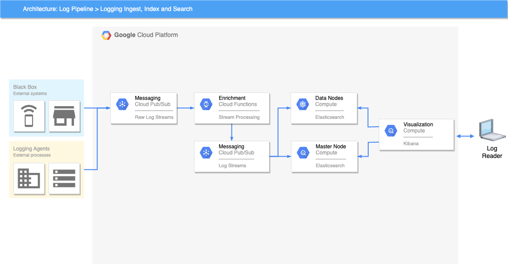

# reference-search-cluster
Reference Search Cluster




A reference Elastic Search cluster and data pipeline leveraging managed services, on-demand and spot VM instances for a focus on cost efficiency.


### Build

Prerequisites:
- Empty VPC with no subnets
- The following APIs enabled:
    - Compute Engine API
    - Artifact Registry API
    - Identity and Access Management API


#### Configure ADC

Set the Google Application Default credentials:
```
gcloud auth application-default login
```

##### Build the Network


#### Configure Environment Variables

Use the example .env.example files to create an .env file with correct details:
```
cp .env.example .env
vi .env
```


Set the Terraform project environment variable:
```
export TF_VAR_project_id="<gcp-project-id>"
```

Set the base directory environment variable:
```
export BASE_DIR=$PWD
```


### Building the Cluster

#### Build the infrastructue
Ensure the execution environment is prepared as above.

```
cd $BASE_DIR/infrastructure
terraform init
terraform fmt
terraform validate
terraform plan -out terraform.plan
terraform apply terraform.plan
cd $BASE_DIR
```

#### Build the data node image
Ensure the execution environment is prepared as above.

1.) Build the data-node image:

```
cd $BASE_DIR/images/data-node/create

cd $BASE_DIR
```


### Post Installation Tasks

#### Grafana Post Installation tasks

##### Add the Prometheus data source

Through the grafana UI add a Prometheus data source via

Home -> Connections -> Data Sources -> Prometheus

then add the localhost instance on port 9090

Prometheus Server URL: http://localhost:9090

Finally click the Save & Test button


##### Add the Node Exporter Dashboard

The Node Exporter Full dashboard can be imported with the Dashboard ID via the Grafana UI

Home -> Dashboards -> New/Import button

In the 'Import via grafana.com' text box add:

1860

The click 'Load'.  From the 'Import Dashboard' window, select 'Prometheus' as the data source for the dashboard and then set the dashboard settings as preferred before clicking 'Import'.


##### Add Prometheus


##### Spot VM Managed Instance Group

To create the Managed Instance Group of Spot VMs, 